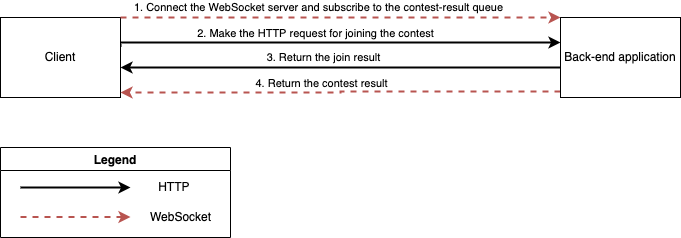

# Lottery System

### Start the application
The startup process will take about 10min to build the artifact in the maven container and deploy it on the tomcat container

    docker compose up   
### Overview

### Limitations
- Lack of Scalability
  - The scheduler is triggered multiple times since there are multiple instances running on different servers
    - **Solution**: Add a line of code at the beginning of startContest method to acquire the lock from Database/Redis, and the server that acquires the lock can execute the rest of code
  - Data are distributed on different servers
    - **Solution**: Store data in the centralised datastore, such as Redis/ Database
- Stateful Service
    - In case of server downtime, all data will be lost
        - **Solution**: Store data in the persistent storage, such as Redis/ Database
  
### Diary
- 20mins - Understand the requirement and draw the diagram
- 3hrs - Coding and Testing
- 15mins - Write README.md